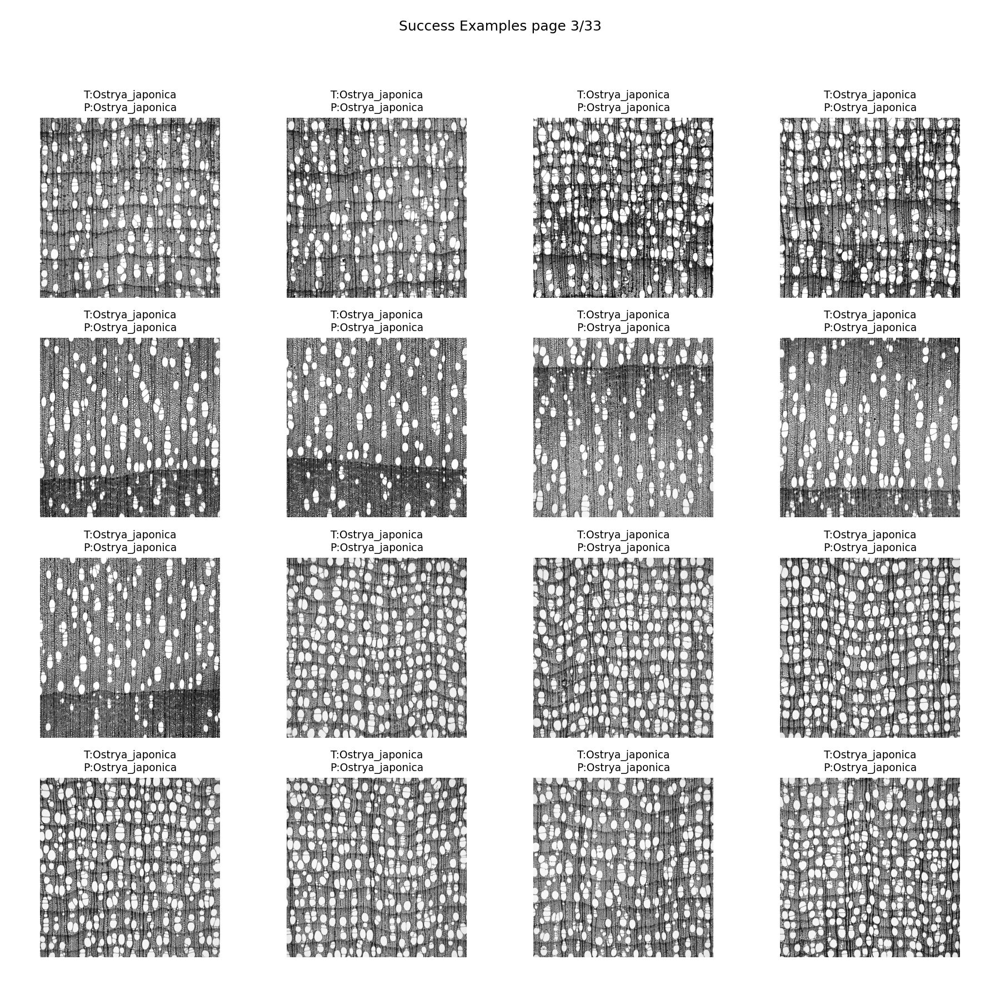
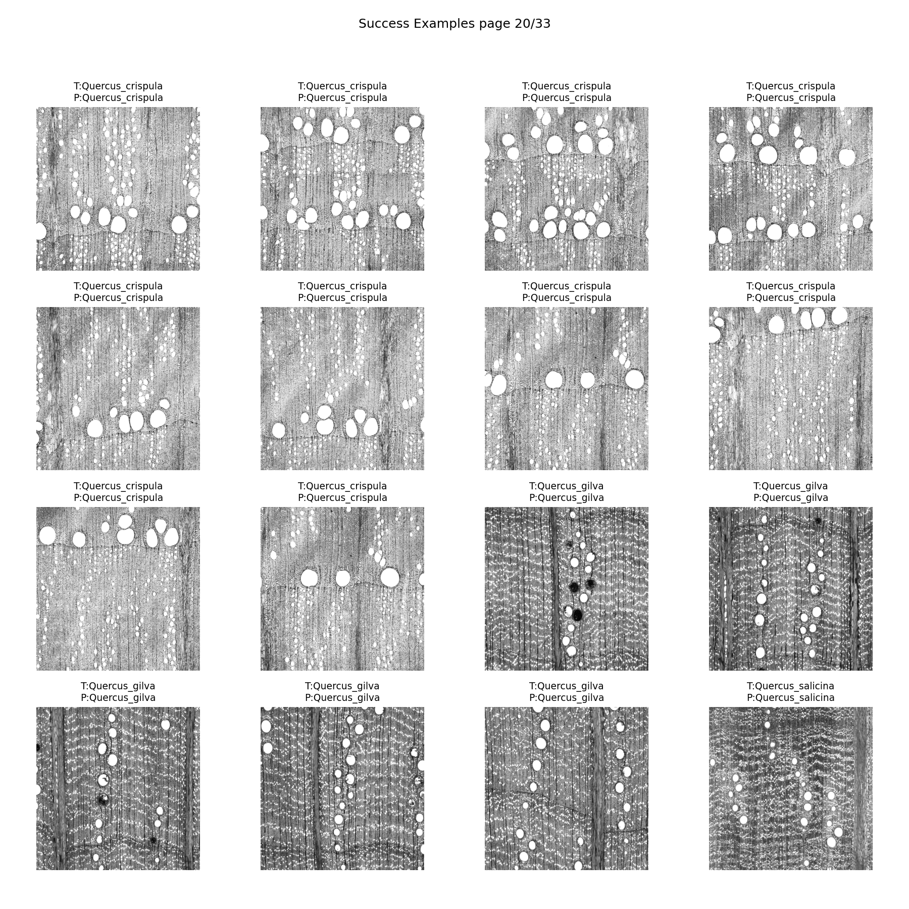
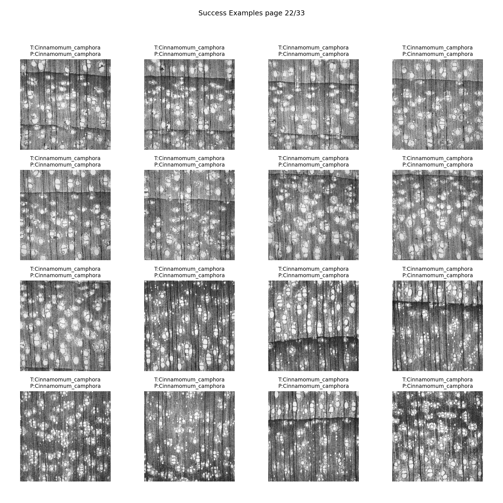
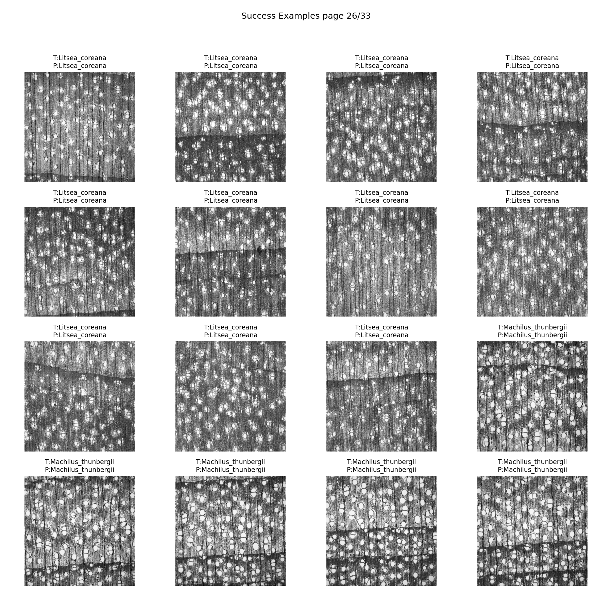
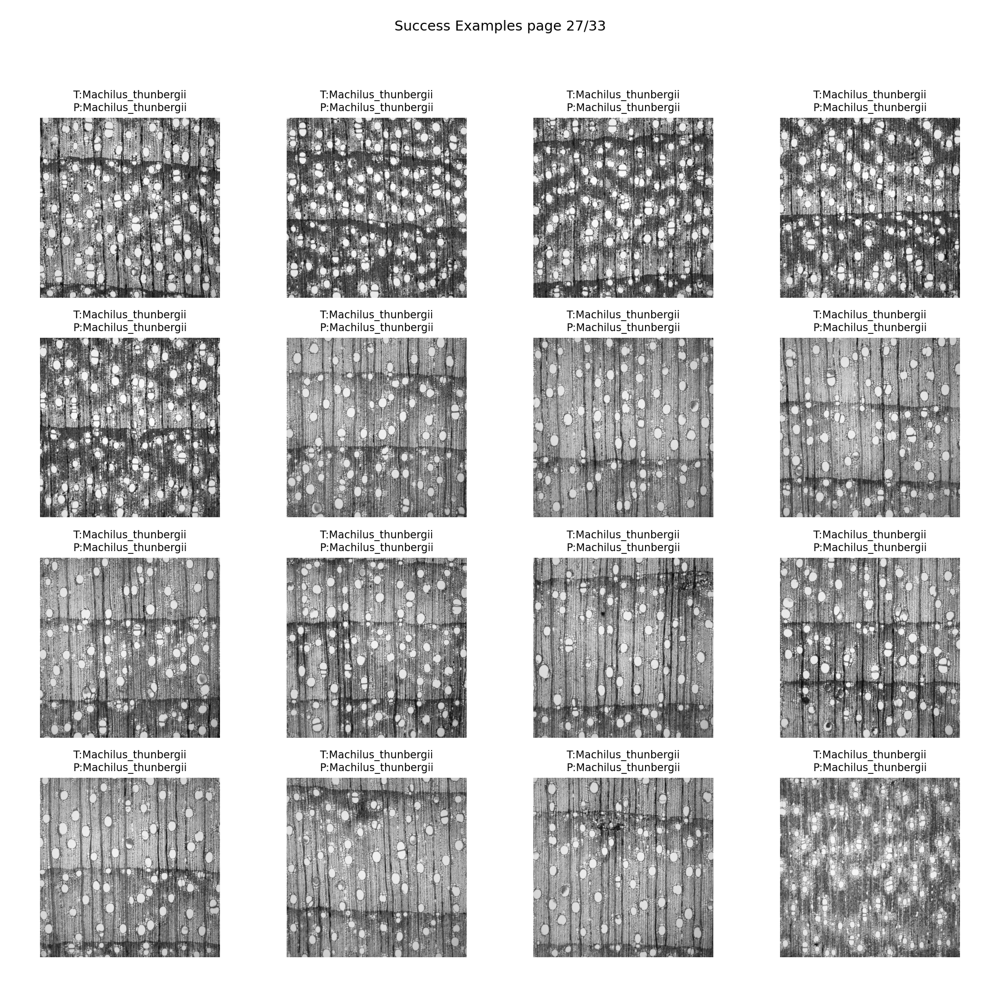
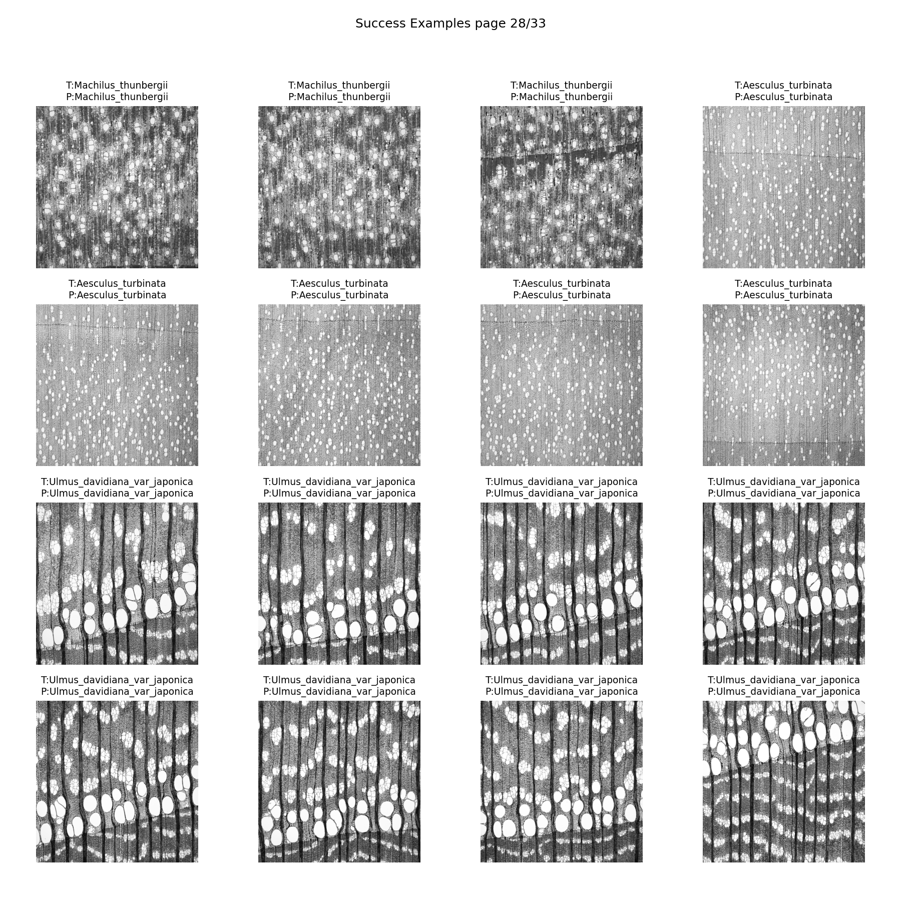
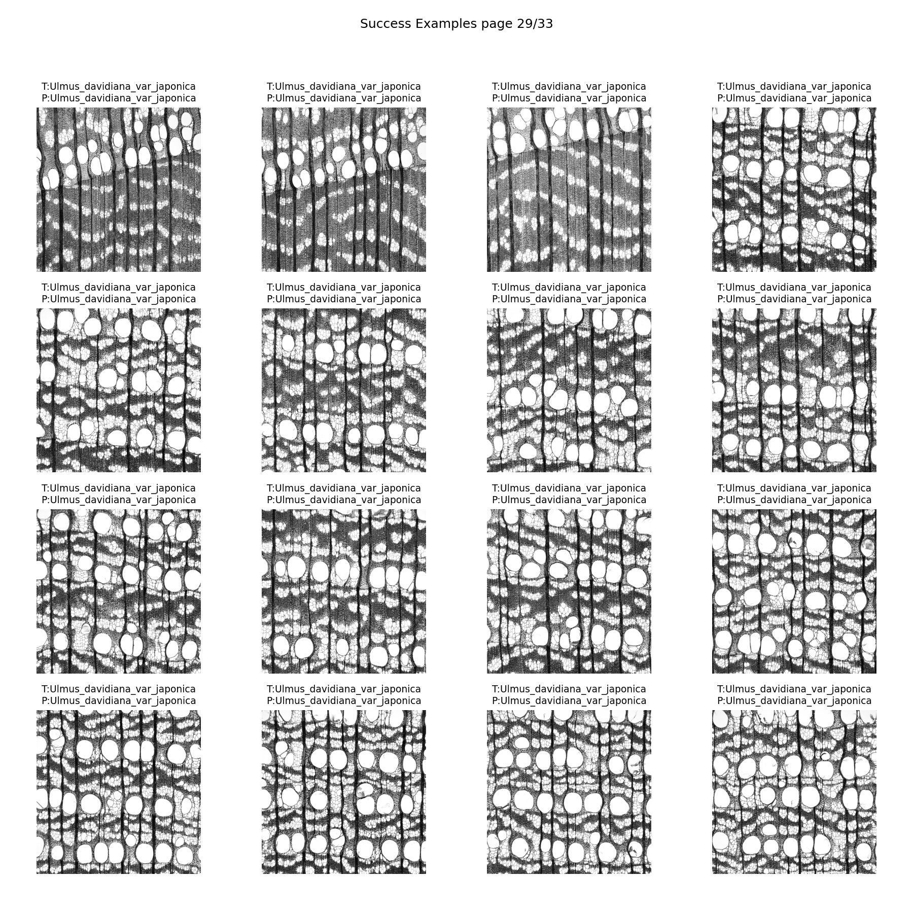
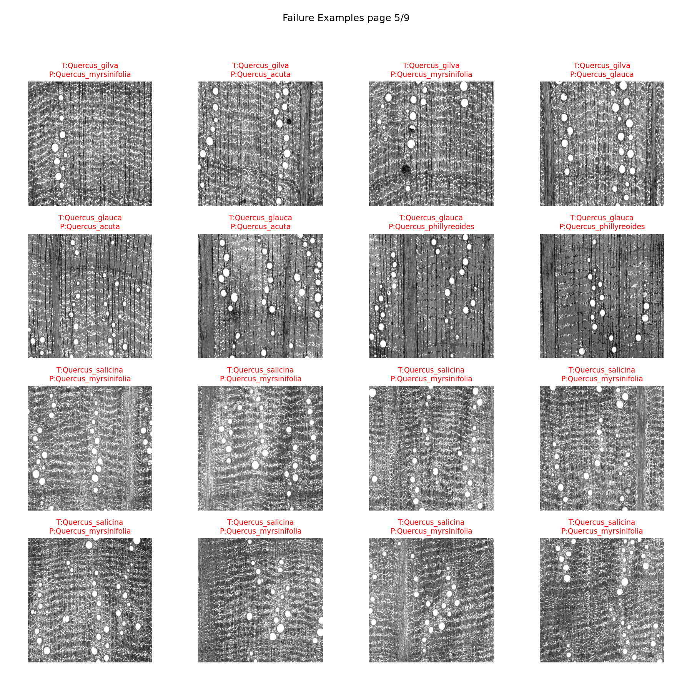
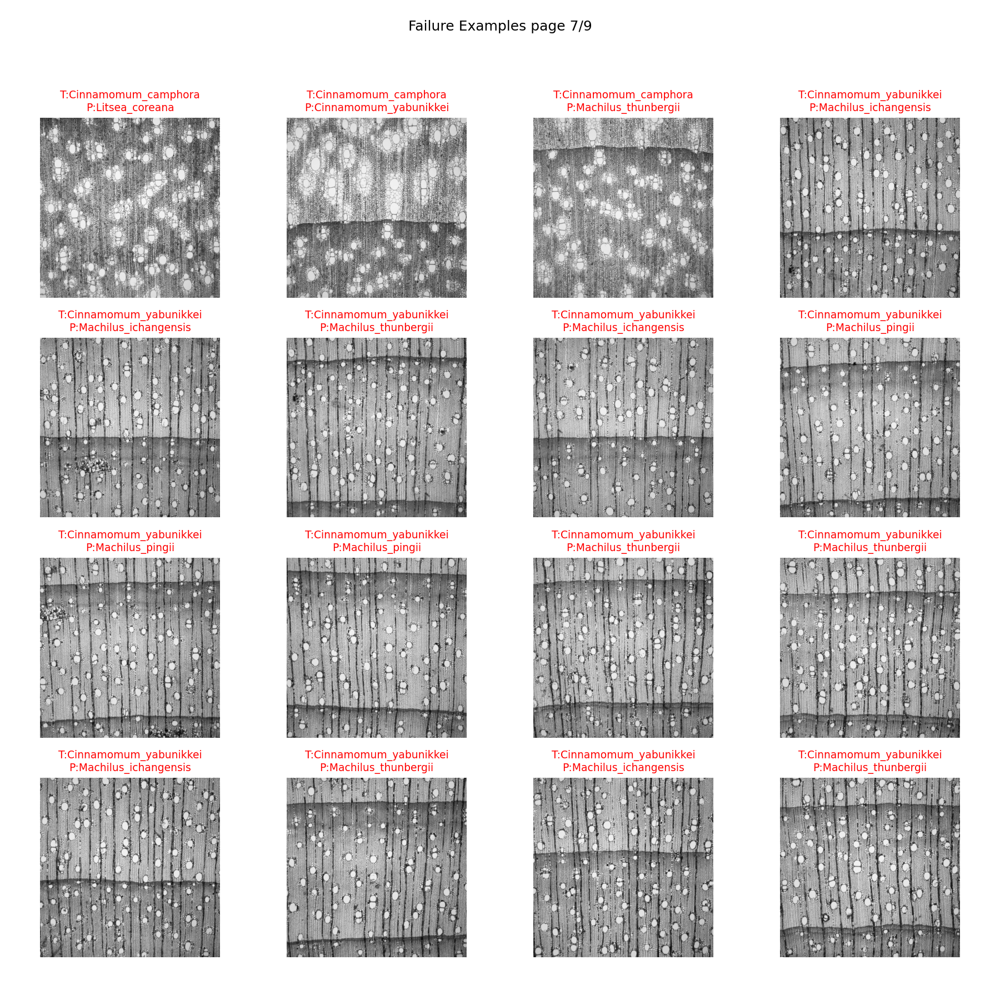
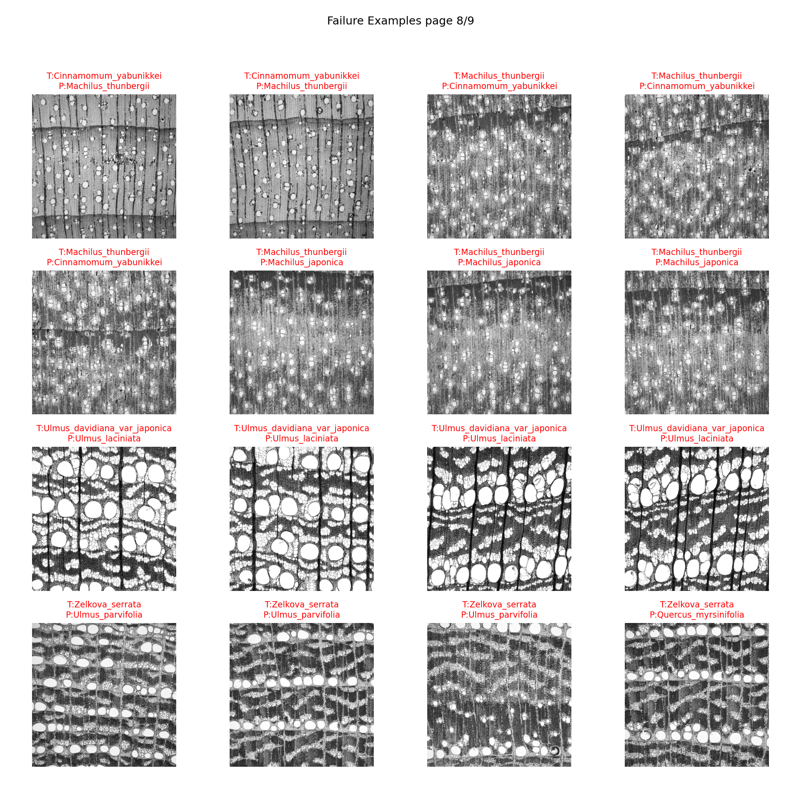

# テストデータセットにおける分類結果（詳細）

## 全体精度

* **Top-1 Accuracy**: **0.798**
* **Top-5 Accuracy**: **0.930**
* **min\_support**: 5
  （サポート数が 5 未満のクラスは除外。画像枚数が極端に少ない種については学習データに全振りしているため。）

## 種別ごとの分類指標

<b>Classification Report</b>

| Species                       | Precision | Recall | F1-score | Support |
| ----------------------------- | --------- | ------ | -------- | ------- |
| Aesculus turbinata            | 1.000     | 1.000  | 1.000    | 5       |
| Aphananthe aspera             | 1.000     | 1.000  | 1.000    | 33      |
| Carpinus japonica             | 1.000     | 0.182  | 0.308    | 11      |
| Carpinus tschonoskii          | 0.769     | 0.455  | 0.571    | 22      |
| Castanea crenata              | 1.000     | 1.000  | 1.000    | 34      |
| Castanopsis cuspidata         | 1.000     | 0.878  | 0.935    | 41      |
| Castanopsis sieboldii         | 0.684     | 1.000  | 0.813    | 13      |
| Celtis sinensis               | 1.000     | 1.000  | 1.000    | 15      |
| Cinnamomum camphora           | 1.000     | 0.923  | 0.960    | 52      |
| Cinnamomum yabunikkei         | 0.667     | 0.400  | 0.500    | 25      |
| Corylus sieboldiana           | 1.000     | 1.000  | 1.000    | 12      |
| Fagus crenata                 | 0.903     | 0.538  | 0.675    | 52      |
| Fagus japonica                | 0.333     | 0.800  | 0.471    | 15      |
| Lithocarpus edulis            | 0.889     | 1.000  | 0.941    | 16      |
| Litsea coreana                | 0.909     | 1.000  | 0.952    | 20      |
| Machilus thunbergii           | 0.767     | 0.767  | 0.767    | 30      |
| Ostrya japonica               | 1.000     | 0.973  | 0.986    | 37      |
| Quercus acuta                 | 0.875     | 0.318  | 0.467    | 22      |
| Quercus crispula              | 0.900     | 0.982  | 0.939    | 55      |
| Quercus gilva                 | 0.385     | 0.556  | 0.455    | 9       |
| Quercus salicina              | 0.636     | 0.368  | 0.467    | 19      |
| Quercus serrata               | 1.000     | 0.333  | 0.500    | 9       |
| Quercus variabilis            | 1.000     | 0.444  | 0.615    | 9       |
| Ulmus davidiana var. japonica | 1.000     | 0.833  | 0.909    | 30      |
| Ulmus laciniata               | 0.792     | 1.000  | 0.884    | 19      |
| Ulmus parvifolia              | 0.667     | 1.000  | 0.800    | 10      |
| Zelkova serrata               | 1.000     | 0.750  | 0.857    | 28      |

## 考察

* **全体性能**

  * **Top-1 Accuracy = 0.798**, **Top-5 Accuracy = 0.930**。
  * Top-5 では 9割超のカバー率を達成しており、候補集合には高確率で正解が含まれる。一方で Top-1 では約 20% の誤分類が残り、依然として単一判定は難しい。

* **完全分類できた種（F1 = 1.0）**

  * *Aesculus turbinata*, *Aphananthe aspera*, *Castanea crenata*, *Celtis sinensis*, *Corylus sieboldiana* など。
  * 他属との区別が明瞭で、少数サンプルでも確実に識別できることを示す。

* **高精度種（F1 > 0.9）**

  * *Ostrya japonica*（≈0.99）, *Cinnamomum camphora*（≈0.96）, *Litsea coreana*（≈0.95）, *Lithocarpus edulis*（≈0.94）, *Quercus crispula*（≈0.94）, *Castanopsis cuspidata*（≈0.94）, *Ulmus davidiana var. japonica*（≈0.91）。
  * サポート数が多い種に加え、固有のスペクトル特徴を持つ種は安定して高精度。

* **中精度（F1 ≈ 0.7–0.8台）**

  * *Machilus thunbergii*（0.77）, *Castanopsis sieboldii*（0.81）, *Fagus crenata*（0.68）, *Ulmus laciniata*（0.88）, *Zelkova serrata*（0.86）。
  * 一定水準の識別力はあるが、誤分類パターンも確認され改善余地がある。

* **低精度種（F1 < 0.5 前後）**

  * *Carpinus japonica*（0.31）, *Quercus acuta*（0.47）, *Quercus salicina*（0.47）, *Fagus japonica*（0.47）, *Quercus gilva*（0.46）, *Quercus serrata*（0.50）。
  * 特に *Carpinus japonica* は recall = 0.18 と低く、ほとんどが他種に吸収される。Quercus 属や Fagus 属は同属間の混同が顕著。

* **誤分類の傾向**

  * **高 precision・低 recall**（例: *Carpinus japonica*）→ 判定は正確だが数が少なく、過度に保守的。
  * **高 recall・低 precision**（例: *Cinnamomum yabunikkei*）→ 他クラスを取り込みやすく、判定が過剰。
  * **両方低め**（例: *Fagus japonica*）→ 識別そのものが不安定。

* **属・科レベルでの難しさ**

  * *Quercus* 属（アカガシ・ナラ類）、*Fagus* 属（ブナ類）での混同が大半を占める。これらは形態的にも近縁で、差異も微小。
  * 一方、*Aphananthe* や *Celtis* のように孤立した特徴を持つ属は安定分類が可能。

### まとめ

* **データ的に区別しやすい種は完全に識別可能**。
* しかし **近縁属間（Quercus, Fagus）での誤分類は依然として課題**。
* 完全識別可能な種と識別困難な種が二極化しており、学習データ拡充や近縁種特化の表現学習が精度向上の鍵となる。

このように「完全に分類できる種」と「近縁種で混同する種」の両極が明確に現れており、**タスクの難易度（微細差判定の必要性）** が定量的に裏付けられています。

## 分類結果ギャラリー（正解例 / 誤分類例）

`T`: True , `P`: Predict

<b>正解例</b>

<b>誤分類例</b>

