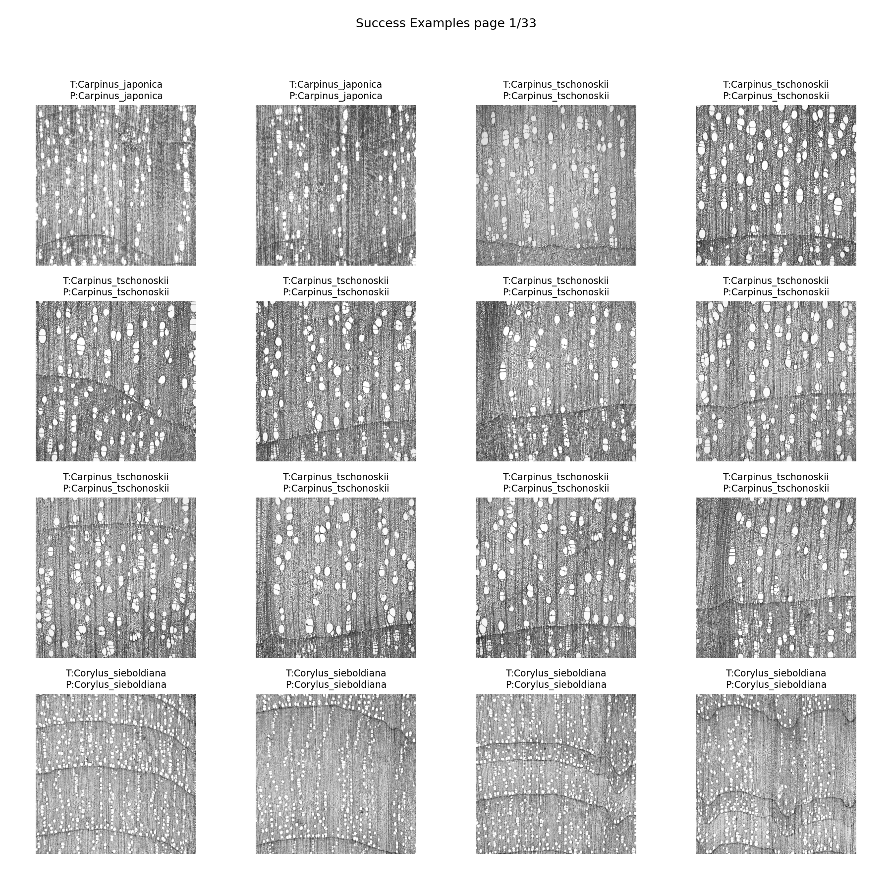
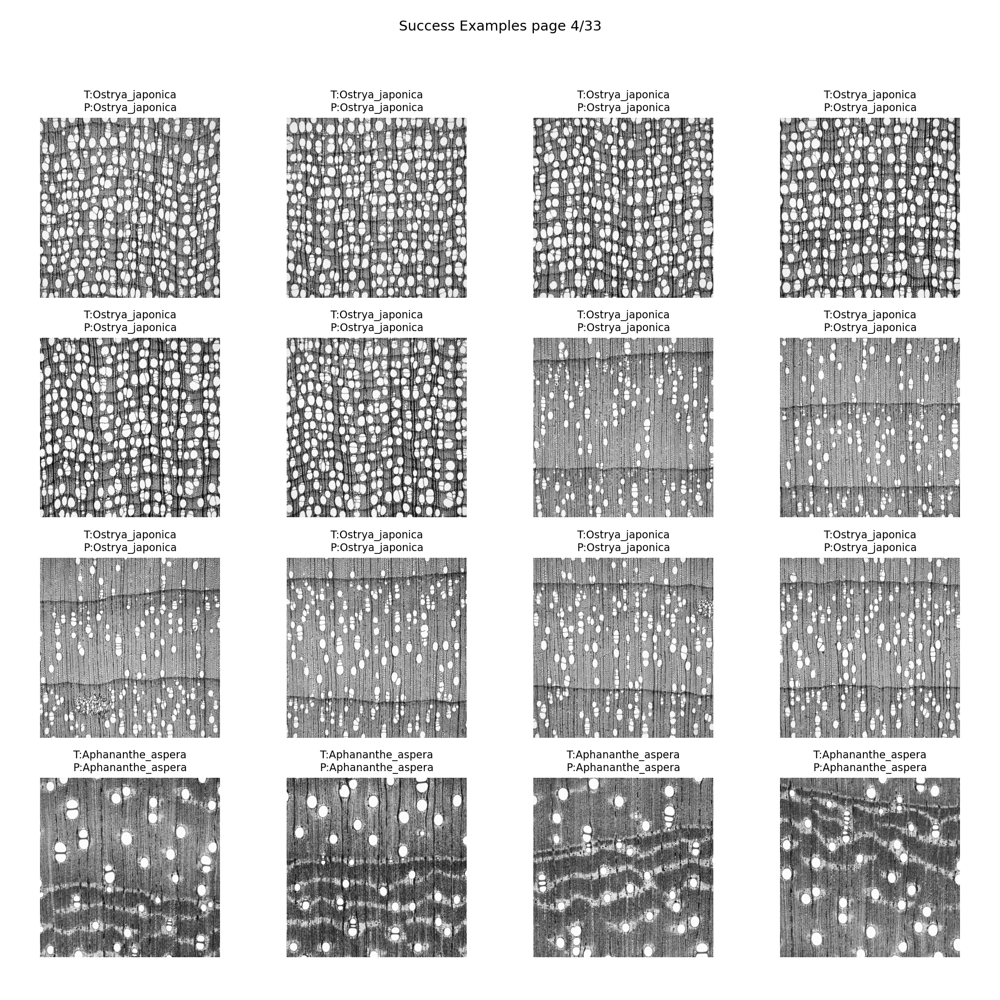
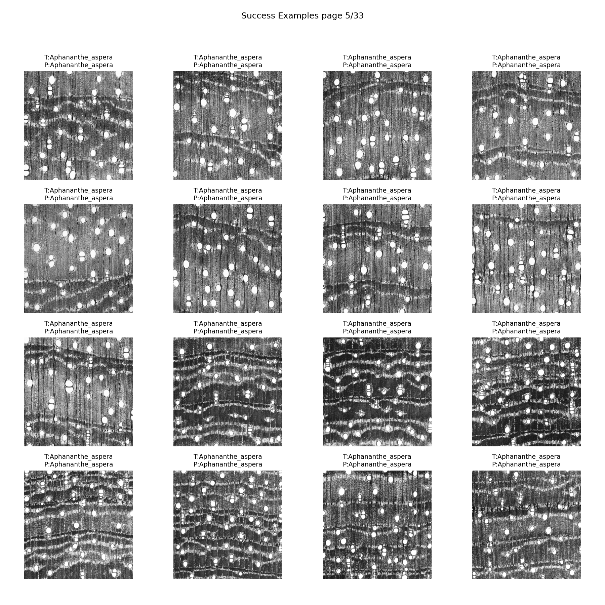
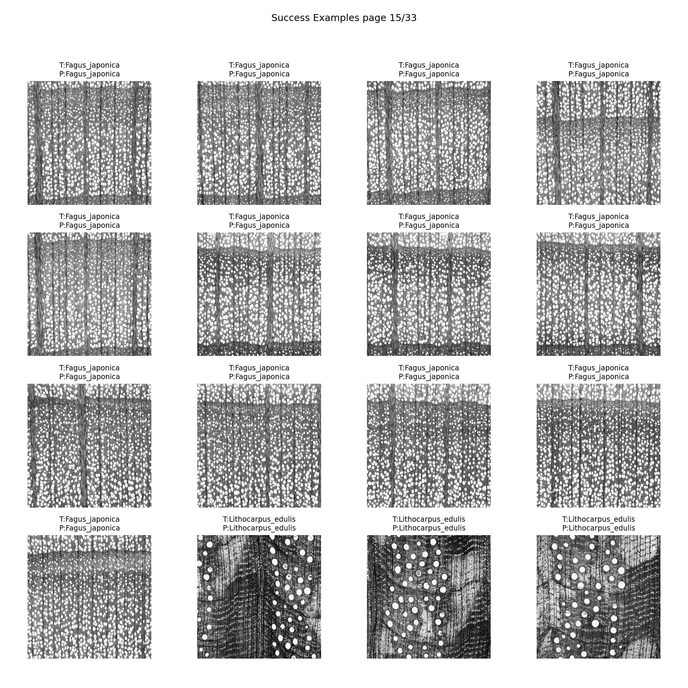
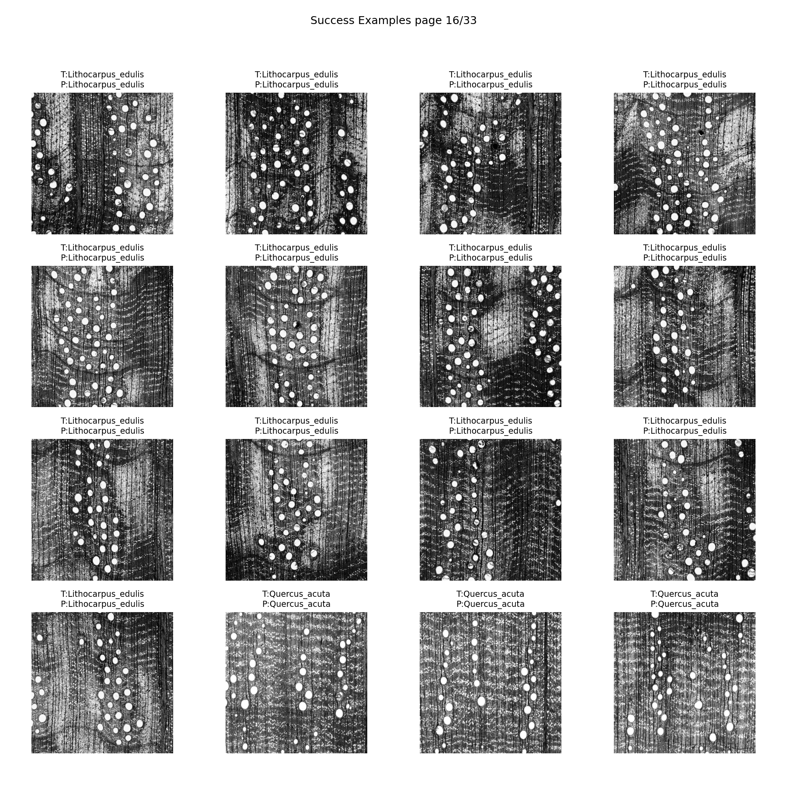
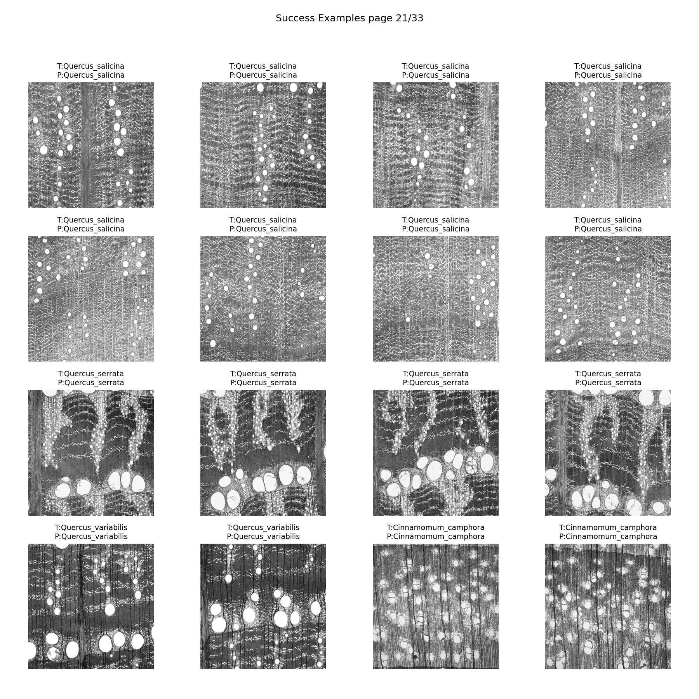
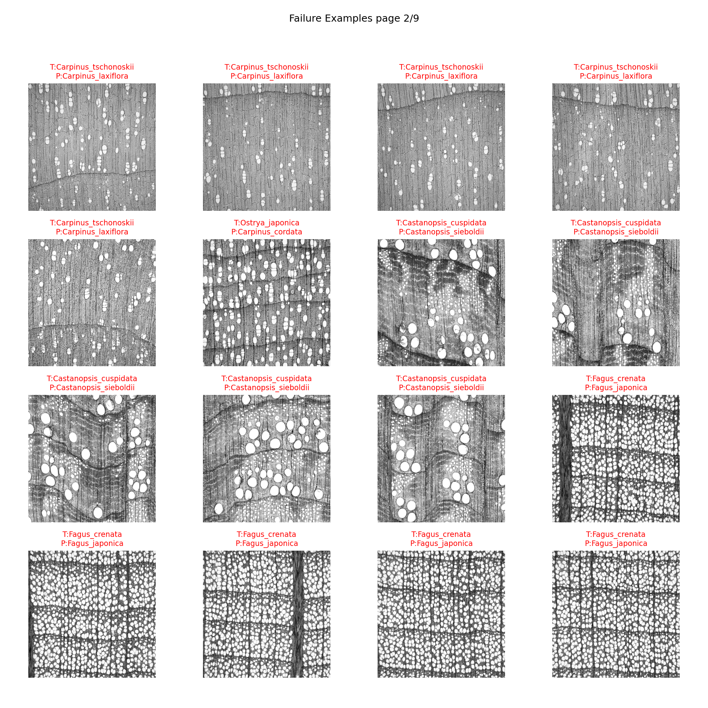
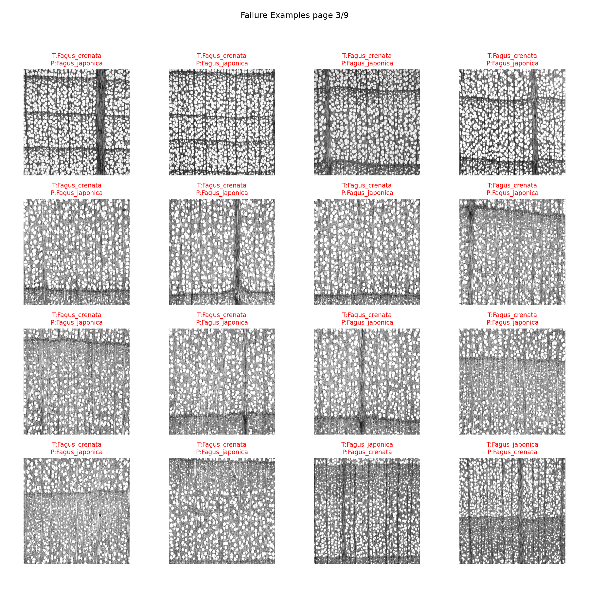

# テストデータセットにおける分類結果（詳細）

## 全体精度

* **Top-1 Accuracy**: **0.785**
* **Top-5 Accuracy**: **0.923**
* **min\_support**: 5
  （サポート数が 5 未満のクラスは除外。画像枚数が極端に少ない種については学習データに全振りしているため。）

## 種別ごとの分類指標

| Species                       | Precision | Recall | F1-score | Support |
| ----------------------------- | --------- | ------ | -------- | ------- |
| Aesculus turbinata            | 1.000     | 1.000  | 1.000    | 5       |
| Aphananthe aspera             | 1.000     | 1.000  | 1.000    | 33      |
| Carpinus japonica             | 1.000     | 0.182  | 0.308    | 11      |
| Carpinus tschonoskii          | 0.769     | 0.455  | 0.571    | 22      |
| Castanea crenata              | 1.000     | 1.000  | 1.000    | 34      |
| Castanopsis cuspidata         | 1.000     | 0.878  | 0.935    | 41      |
| Castanopsis sieboldii         | 0.684     | 1.000  | 0.813    | 13      |
| Celtis sinensis               | 1.000     | 1.000  | 1.000    | 15      |
| Cinnamomum camphora           | 1.000     | 0.923  | 0.960    | 52      |
| Cinnamomum yabunikkei         | 0.667     | 0.400  | 0.500    | 25      |
| Corylus sieboldiana           | 1.000     | 1.000  | 1.000    | 12      |
| Fagus crenata                 | 0.903     | 0.538  | 0.675    | 52      |
| Fagus japonica                | 0.333     | 0.800  | 0.471    | 15      |
| Lithocarpus edulis            | 0.889     | 1.000  | 0.941    | 16      |
| Litsea coreana                | 0.909     | 1.000  | 0.952    | 20      |
| Machilus thunbergii           | 0.767     | 0.767  | 0.767    | 30      |
| Ostrya japonica               | 1.000     | 0.973  | 0.986    | 37      |
| Quercus acuta                 | 0.875     | 0.318  | 0.467    | 22      |
| Quercus crispula              | 0.900     | 0.982  | 0.939    | 55      |
| Quercus gilva                 | 0.385     | 0.556  | 0.455    | 9       |
| Quercus salicina              | 0.636     | 0.368  | 0.467    | 19      |
| Quercus serrata               | 1.000     | 0.333  | 0.500    | 9       |
| Quercus variabilis            | 1.000     | 0.444  | 0.615    | 9       |
| Ulmus davidiana var. japonica | 1.000     | 0.833  | 0.909    | 30      |
| Ulmus laciniata               | 0.792     | 1.000  | 0.884    | 19      |
| Ulmus parvifolia              | 0.667     | 1.000  | 0.800    | 10      |
| Zelkova serrata               | 1.000     | 0.750  | 0.857    | 28      |

## 考察

* **全体性能**

  * **Top-1 Accuracy = 0.785**, **Top-5 Accuracy = 0.923**。
  * Top-5 では9割を超えており、「候補集合には正解が入る」ケースが大多数である一方、Top-1 に絞ると約2割弱の誤分類が残ることが分かる。

* **完全に分類できた種（F1 = 1.0）**

  * *Aesculus turbinata*, *Aphananthe aspera*, *Castanea crenata*, *Celtis sinensis*, *Corylus sieboldiana* などで precision・recall がともに 1.0。
  * これらは他種との差異が明瞭で、かつサンプル数もサポートを満たしており、学習が安定していると考えられる。

* **高精度を達成した種（F1 > 0.9）**

  * *Ostrya japonica*（F1 ≈ 0.99）, *Cinnamomum camphora*（F1 ≈ 0.96）, *Litsea coreana*（F1 ≈ 0.95）, *Lithocarpus edulis*（F1 ≈ 0.94）, *Quercus crispula*（F1 ≈ 0.94）など。
  * 多くは support 数が比較的多く、学習データのカバレッジが良いことが高精度に寄与している。

* **中程度の精度（F1 ≈ 0.7–0.8）**

  * *Fagus crenata*（F1 ≈ 0.67）, *Machilus thunbergii*（F1 ≈ 0.77）, *Castanopsis sieboldii*（F1 ≈ 0.81）, *Ulmus laciniata*（F1 ≈ 0.88）, *Zelkova serrata*（F1 ≈ 0.86）など。
  * 精度は一定以上確保できているが、誤分類の傾向も見られ、さらなる改良余地がある。

* **課題の大きい種（F1 < 0.5 前後）**

  * *Carpinus japonica*（F1 ≈ 0.31）, *Quercus acuta*（F1 ≈ 0.47）, *Quercus salicina*（F1 ≈ 0.47）, *Fagus japonica*（F1 ≈ 0.47）, *Quercus gilva*（F1 ≈ 0.45）, *Quercus serrata*（F1 ≈ 0.50）など。
  * 特に **Quercus 属内**では複数の種で recall が低下し、同属間の混同が顕著に現れている。

* **誤分類の傾向**

  * recall が極端に低い (*Carpinus japonica*: 0.18) ケースは「真陽性を取り逃がし、多くを他クラスに吸われる」傾向。
  * precision が高く recall が低い場合は「正と判定したときは正しいが、その判定自体が少ない」＝識別が保守的になっていると解釈できる。
  * 一方で recall が高く precision が低いケースは、クラス外を取り込みやすく、過剰にラベルを広げていることを示唆。

* **属・科レベルでの課題**

  * *Quercus* 属（アカガシ類・ナラ類）や *Fagus* 属（ブナ類）など、**形態的に近縁で境界が曖昧なグループ**において誤分類が集中している。
  * 逆に *Aphananthe* や *Celtis* のように属単位でも比較的孤立した特徴を持つ種は安定して正しく分類されている。

#### まとめ

* **データ的に区別しやすい種は完全に識別可能**。
* **近縁属（特に Quercus・Fagus）では誤分類が顕著**で、Top-5 には正解が入るものの Top-1 判定が困難。
* **精度が偏在**していることから、学習データ拡充や近縁種に特化した表現学習が必要であることが読み取れる。

このように「完全に分類できる種」と「近縁種で混同する種」の両極が明確に現れており、**タスクの難易度（微細差判定の必要性）** が定量的に裏付けられています。

## 分類結果ギャラリー（正解例 / 誤分類例）

<b>正解例</b>

<b>誤分類例</b>

