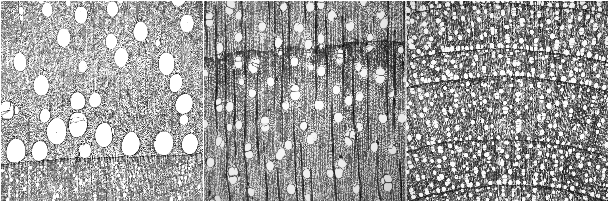
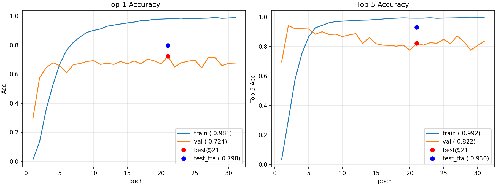
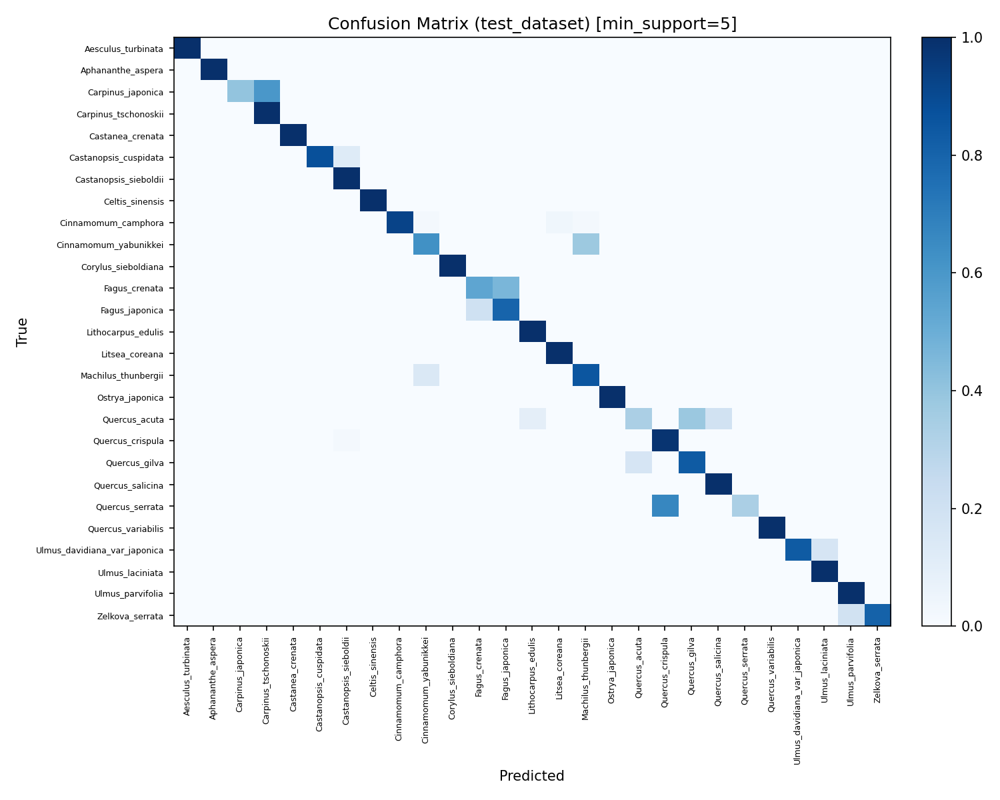
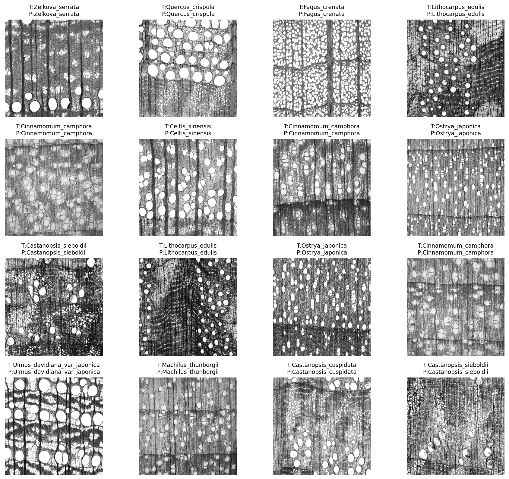
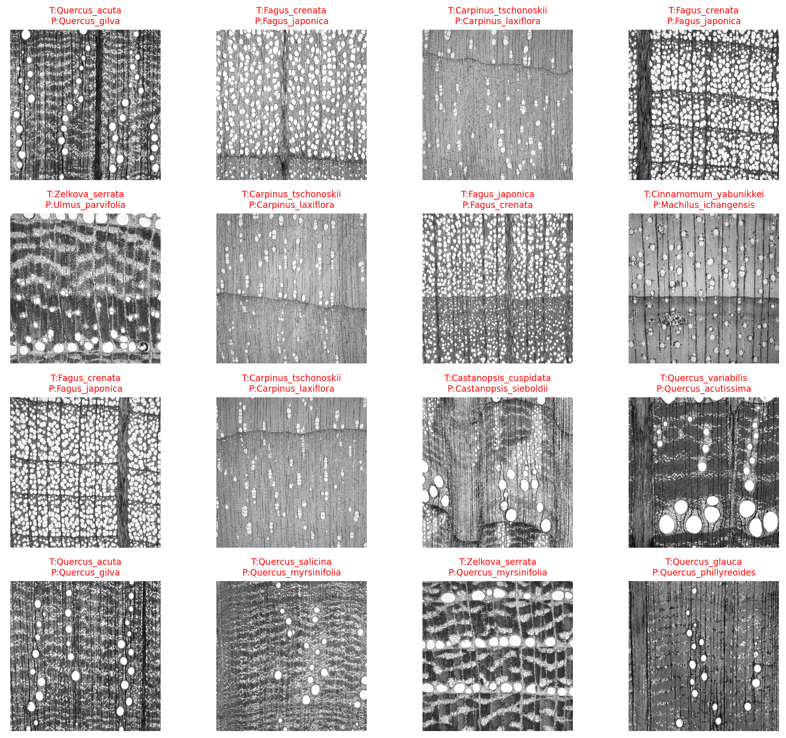

# Wood Micrograph Classification

<p>
  
  
  <a href="LICENSE">
    
  </a>
</p>

> 夏休みの自由研究（M1）

## 概要

本リポジトリは、**広葉樹の光学顕微鏡画像**を対象とした **種分類** の実装と評価をまとめたものです。目的は、非常に類似した木材顕微鏡像を高精度に識別する基盤的手法を検討することにあります。

<p align="center">

</p>

## 課題

本タスクでは、同一 family / genus 内での種識別も求められます。これらの種は組織構造が極めて類似しており、クラス間マージンは非常に小さい一方で、個体差や切片条件、照明環境などによるクラス内分散は大きいという難しさがあります。結果として、識別は「双子を見分ける」ことに匹敵するほどの微差判定を要する課題となります（個人的な感想）。<br>

当初は CNN（ResNet, ConvNeXt など）を用いたアプローチを試みましたが、局所的なテクスチャや形状に強く依存するため、個体差や切片条件の影響を受けやすく、十分な識別境界を形成することができませんでした。そこで課題の本質を改めて検討した結果、「ごくわずかな形態的差異を、大きなクラス内変動の中から抽出する」という点で、本問題は **顔認証** に近い性質を持つと考えられます。すなわち、局所的な特徴よりも画像全体に広がる大域的特徴を捉え、それを基盤として識別境界を構築することが求められるのです。この認識に基づき、本研究では Transformer 系のバックボーンを採用するとともに、顔認証分野で実績のある角距離学習（SubCenter-ArcFace）や補助損失（Center Loss）を取り入れました。

## Dataset（Xylarium Digital Database: XDD\_016）

**Xylarium Digital Database for Wood Information Science and Education** に含まれる広葉樹の光学顕微鏡像を使用しました。

* Families: 7
* Genera: 33
* Species: 119
* Individuals: 540
* Images: 7,051
* 実観察領域: 2.7 × 2.7 mm² / 解像度: 2.96 µm/px

<details>
<summary><b>Family別の概要（上位のみ）</b></summary>

| family       | n\_species | images |
| ------------ | ---------- | ------ |
| Fagaceae     | 18         | 2446   |
| Lauraceae    | 39         | 1658   |
| Magnoliaceae | 18         | 926    |
| Betulaceae   | 19         | 817    |
| Sapindaceae  | 18         | 444    |
| Ulmaceae     | 4          | 443    |
| Cannabaceae  | 3          | 317    |

</details>

<details>
<summary><b>Species別 枚数上位（Top-10）</b></summary>

| species                | images |
| ---------------------- | ------ |
| Quercus\_crispula      | 266    |
| Fagus\_crenata         | 225    |
| Cinnamomum\_camphora   | 221    |
| Machilus\_thunbergii   | 210    |
| Quercus\_salicina      | 188    |
| Fagus\_japonica        | 180    |
| Litsea\_coreana        | 180    |
| Castanea\_crenata      | 177    |
| Quercus\_myrsinifolia  | 168    |
| Cinnamomum\_yabunikkei | 158    |

</details>

<br>

詳細は DOI [10.14989/XDD\_016](https://doi.org/10.14989/XDD_016) を参照してください。

## 方法

### モデル構成

* **バックボーン**: `MaxViT (maxvit_tiny_rw_224)`
* **ヘッド**: SubCenter-ArcFace（サブセンタ対応, `subcenters=4`）
* **補助損失**: Center Loss 併用

### 学習戦略

* 損失関数: Cross-Entropy + Label Smoothing（既定）／Focal Loss 切替可
* ArcFace: margin ウォームアップ, Center Loss λ ウォームアップ
* 学習率スケジューラ: CosineAnnealingWarmRestarts（再スタート長め）
* EMA（Exponential Moving Average）
* Balanced Sampler によるクラス不均衡補正

### データ前処理

* **層化分割**: 個体 ID 単位で層化、サンプル少数種（5枚未満）は train に配置
* **データ拡張**: Flip/Rotate(90°), Scale Jitter(±15%), Brightness/Contrast(±10%, ±0.05), Gamma (±10%)
* **検証/テスト**: Resize + Normalize（TTA は最終評価時）

### 実行スクリプト

* `1_train.py` : 学習と test 評価、結果を JSON 保存
* `2_eval_best.py` : best checkpoint をロードし TTA 評価
* `3_visualize_runs.py` : history.json と test 結果を可視化
* `4_eval_confusion_and_examples.py` : 混同行列と成功/失敗例を出力

## 結果

### 精度概要

* 学習精度
  * Top-1: **0.981** / Top-5: **0.992**
* 検証精度
  * Top-1: **0.724** / Top-5: **0.822**
* テスト精度（TTAあり）
  * Top-1: **0.798** / Top-5: **0.930**

<p align="center">
 <br>
<b>Fig. 1</b> 学習精度の履歴
</p>

### 成功例と課題

分類結果の詳細については[こちら](Classification_Report.md)

* 完全分類を達成した種: *Aesculus turbinata*, *Castanea crenata* など。
* 高精度を示した種: *Ostrya japonica* (F1≈0.99), *Cinnamomum camphora* (F1≈0.95) など。
* 誤分類が目立つ種: *Carpinus japonica* (F1≈0.31), *Quercus variabilis* (F1≈0.36) など。同属内取り違えが顕著。

<p align="center">
<br> 
<b>Fig. 2</b> テストデータセットにおける混同行列
</p>

### 分類結果一例
> `T`: True , `P`: Predict

<p align="center">
<br> 
<b>Fig. 3</b> 分類成功例
</p>

<p align="center">
<br> 
<b>Fig. 4</b> 分類失敗例
</p>


## まとめ

本研究では **Top-1 精度 ≈ 0.80, Top-5 精度 ≈ 0.93** を達成しました。課題としては、特に **Quercus 属内の細分類**とサンプル数が少ない種での誤分類が残ります。また未知個体に対する汎化性能も今後の改善対象です。今後はデータ拡張や前処理、サンプリング設計の最適化を通じてさらなる性能向上を目指します。

---

## 謝辞

本研究では、京都大学生存圏研究所 Xylarium Digital Database (XDD\_016) を利用しました。関係者の皆様に深く感謝いたします。

## 引用

> Junji SUGIYAMA, Sung Wook HWANG, ShengCheng ZHAI, Kayoko KOBAYASHI, Izumi KANAI, Keiko KANAI (2020).
> *Xylarium Digital Database for Wood Information Science and Education (XDD\_016)* \[dataset].
> DOI: 10.14989/XDD\_016 — URI: [http://hdl.handle.net/2433/250046](http://hdl.handle.net/2433/250046)

---

## リポジトリ構成・ライセンス

```bash
project/
├── data/                               # データ
│   ├── WIG_v1.2.1_900.h5               # 木材顕微鏡画像データ（容量大・追跡対象外）
│   └── wig_v1.2.1_index.csv            # メタ情報
│
├── results/                            # 可視化や評価結果の出力先
│
├── runs/                               # 学習結果の記録
│   ├── best_model.pt                   # 学習済みモデルの重み（容量大・追跡対象外）
│   ├── history.json                    # 学習過程の履歴
│   ├── test_tta.json                   # TTA 適用後の評価結果
│   └── test.json                       # 通常の評価結果
│
├── src/                                # コアとなるソースコード群
│   ├── config_utils.py                 # 設定ファイル (YAML) の読み込み・管理
│   ├── data_pipeline.py                # Dataset, Sampler, DataLoader, 前処理関連
│   ├── model.py                        # モデル定義
│   └── training.py                     # 学習ループ、損失関数、最適化、評価処理
│
├── 1_train.py                          # 学習エントリーポイント
├── 2_eval_best.py                      # best_model を用いた評価（TTA）
├── 3_visualize_runs.py                 # 学習履歴や精度の可視化
├── 4_eval_confusion_and_examples.py    # 混同行列・成功例/失敗例の抽出
│
├── Classification_Report.md            # 詳細な分類レポート
├── config.yaml                         # 実験設定ファイル
├── LICENSE                             # ライセンス情報
├── README.md                           # プロジェクト説明
└── requirements.txt                    # 必要ライブラリ一覧
```

ライセンスは [MIT License](LICENSE) に従います。
