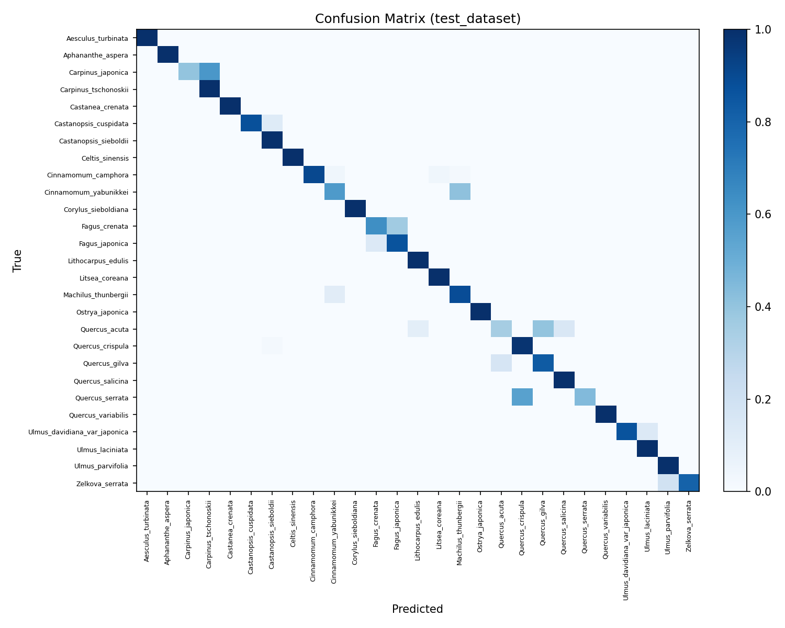

# Wood Micrograph Classification

  
  
  

> 夏休みの自由研究（M1）

本リポジトリは、**広葉樹の光学顕微鏡画像**を対象とした **種分類** の実装です。

## 特徴

* **バックボーン**: `timm` ライブラリ（ConvNeXt / ViT / Swin / MaxViT など）。本実装は `MaxViT (maxvit_tiny_rw_224)` を採用
* **ヘッド**: SubCenter-ArcFace（サブセンタ対応, `subcenters=4`）による角距離学習
* **補助損失**: Center Loss を併用
* **データ前処理**: HDF5 データセットを読み込み、個体単位で層化分割。レア種は train のみに配置  
  **学習時 Aug**: Flip/Rotate(90°), Scale Jitter(±15%), Brightness/Contrast(±10%, ±0.05), Gamma(±10%)  
  **検証/テスト**: Resize + Normalize（TTA は最終評価時に使用）
* **学習戦略**:
  * Cross-Entropy + Label Smoothing（既定）／Focal Loss は任意で切替
  * ArcFace（SubCenter, s/m）：margin のウォームアップ、Center Loss λ のウォームアップ（任意）
  * 学習率スケジューラ: CosineAnnealingWarmRestarts（再スタート間隔は長め）／ReduceLROnPlateau（任意）
  * EMA（Exponential Moving Average）
  * Balanced Sampler によるクラス不均衡補正
  * [Config](config.yaml)

### 実行スクリプト

* `1_train.py` : 学習と test 評価、結果を JSON 保存
* `2_eval_best.py` : best checkpoint をロードし TTA 評価を実行
* `3_visualize_runs.py` : history.json と test 結果を可視化
* `4_eval_confusion_and_examples.py` : 混同行列と成功/失敗例を出力

---

## 背景と課題

本タスクでは、同一 family／同一 genus 内での種判別も求められます。これらの種は微細構造や組織配列が非常に類似しており、クラス間マージンはきわめて小さい一方で、樹体差、切片条件、染色や照明条件などの要因によるクラス内分散は大きくなります。そのため、実質的には「双子を識別するよりも難しい」レベルの微差判定を要する課題となっています（個人的な感想）。 

当初は CNN（ResNet, ConvNeXt など）を用いた手法を試みましたが、局所的なテクスチャや形状に強く依存する傾向があり、個体差や切片条件の影響を受けやすいため、十分な分離境界を形成することは困難でした。すなわち、局所の揺らぎにモデルが引き込まれ、種レベルの識別精度は頭打ちとなりました。 

そこで本研究では、この課題を「顔認証に近い難易度を持つ識別問題」と位置付け、局所的な差異よりも画像全体に広がる大域的特徴に基づいて判別を行うアプローチへと転換しました。バックボーンには Transformer 系モデルである **MaxViT (`maxvit_tiny_rw_224`)** を採用し、識別境界を鋭くするため角距離ベースの **SubCenter-ArcFace（margin ウォームアップ付き）** を導入しました。さらに必要に応じて **Center Loss** を併用し、学習の安定化には **EMA** および **CosineAnnealingWarmRestarts** を用いています。 

データ分割は個体 ID に基づいて層化を行い、希少種はすべて学習データに割り当てました。学習時のデータ拡張には Flip / Rotate(90°)、Scale Jitter (±15%)、Brightness / Contrast (±10%, ±0.05)、Gamma (±10%) を控えめに適用し、検証およびテストでは Resize + Normalize のみに統一しました（TTA は最終評価時のみ実施）。 

これらの工夫により、分類が安定して成立するベースラインを確立することができました。しかしながら、**汎化性能** は依然として主要な課題として残されています。特に未知個体に対する頑健性や確率出力の過信（Cross-Entropy の悪化）には改善の余地があり、**サンプリング設計や前処理・データ拡張の最適化** が精度を大きく左右することが示唆されます。今後は本ベースラインを土台として、より一層の一般化性能の強化に取り組む予定です。

## Dataset（Xylarium Digital Database: XDD\_016）

**Xylarium Digital Database for Wood Information Science and Education** に含まれる広葉樹の光学顕微鏡像を用いています。

* DOI: [10.14989/XDD\_016](https://doi.org/10.14989/XDD_016)
* URI: [http://hdl.handle.net/2433/250046](http://hdl.handle.net/2433/250046)
* コレクション: 木材情報学と教育用材鑑調査室デジタルデータベース

#### Overview

* Families: 7
* Genera: 33
* Species: 119
* Individuals: 540
* Images: 7,051
* 実観察領域: 2.7 × 2.7 mm² / 画像: 900 × 900 px / 解像度: 2.96 µm/px

<b>Family 別の概要（上位のみ）</b>

| family       | n\_species | images |
| ------------ | ---------- | ------ |
| Fagaceae     | 18         | 2446   |
| Lauraceae    | 39         | 1658   |
| Magnoliaceae | 18         | 926    |
| Betulaceae   | 19         | 817    |
| Sapindaceae  | 18         | 444    |
| Ulmaceae     | 4          | 443    |
| Cannabaceae  | 3          | 317    |

<b>Species 別 枚数上位（Top-10）</b>

| species                | images |
| ---------------------- | ------ |
| Quercus\_crispula      | 266    |
| Fagus\_crenata         | 225    |
| Cinnamomum\_camphora   | 221    |
| Machilus\_thunbergii   | 210    |
| Quercus\_salicina      | 188    |
| Fagus\_japonica        | 180    |
| Litsea\_coreana        | 180    |
| Castanea\_crenata      | 177    |
| Quercus\_myrsinifolia  | 168    |
| Cinnamomum\_yabunikkei | 158    |

## 結果

広葉樹顕微鏡画像を用いた種分類 において、学習の推移・テスト評価・精度をまとめました。

### 精度の概要

本研究では、学習過程において 検証精度（ `val_acc` ）が最大となったエポック を `best_model` として保存しました。本モデルでは epoch 21 で `val_acc` が 0.724 に達し、この時点の重みを評価対象としています。

* **学習精度**
  
  * Top-1 Accuracy: **0.981**
  * Top-5 Accuracy: **0.992**

* **検証精度**
  
  * Top-1 Accuracy: **0.724**
  * Top-5 Accuracy: **0.822**

* **テスト精度（TTAあり）**

  * Top-1 Accuracy: **0.798**
  * Top-5 Accuracy: **0.930**

<b>Fig. 1</b> 学習精度の履歴

学習記録の詳細は[こちら](runs/history.json)

### 分類の成功例と課題

**分類結果の詳細については[こちら](Classification_Report.md)**  

* **成功例**

  * *Aesculus turbinata*, *Aphananthe aspera*, *Castanea crenata*, *Celtis sinensis*, *Corylus sieboldiana* などでは **precision/recall/F1 = 1.0** と完全分類を達成。
  * また、*Ostrya japonica*（F1≈0.99）、*Cinnamomum camphora*（F1≈0.95）、*Litsea coreana*（F1≈0.95）、*Quercus crispula*（F1≈0.95）など、多くの主要樹種で高精度を示しました。

* **課題のある種**

  * *Carpinus japonica*（F1≈0.31）、*Quercus acuta*（F1≈0.47）、*Quercus gilva*（F1≈0.45）、*Quercus variabilis*（F1≈0.36）など、一部の樹種で誤分類が目立ちました。
  * 特に **ブナ科（Quercus 属）間** では同属内での取り違えが頻発し、混同行列でもその傾向が確認されます。

 
<b>Fig. 2</b> テストデータセットにおける混同行列

さらに、正解例と誤分類例の一部を可視化し、モデルの挙動を直感的に把握できるようにしました。 
`T`: True , `P`: Predict

* **正解例（一部）**

 
<b>Fig. 3</b> テストデータセットにおける分類成功例

* **誤分類例（一部）**

 
<b>Fig. 4</b> テストデータセットにおける分類失敗例

### まとめ

本モデルは **Top-1 精度 ≈ 0.80、Top-5 精度 ≈ 0.93** と高い分類性能を実現しました。一方で、同属種の識別には依然として課題が残されており、特に **Quercus 属の細分類**やサンプル数の少ないクラスでの改善が今後の焦点となります。また、汎化性能についても今後の課題です。

---

## Acknowledgements

> 本研究（実装）では、京都大学生存圏研究所 Xylarium Digital Database (XDD\_016) を利用しました。京都大学生存圏研究所 データベース全国共同利用専門委員会 (RISH-DATABASE) に深く感謝いたします。また、本成果は京都大学生存圏研究所 データベース利用型共同利用の支援によるものです。

## Citation

> Junji SUGIYAMA, Sung Wook HWANG, ShengCheng ZHAI, Kayoko KOBAYASHI, Izumi KANAI, Keiko KANAI (2020).
> *Xylarium Digital Database for Wood Information Science and Education (XDD\_016)* \[dataset].
> DOI: 10.14989/XDD\_016 — URI: [http://hdl.handle.net/2433/250046](http://hdl.handle.net/2433/250046)

## Licence

本コードは **MIT License** です。詳細は [LICENSE](LICENSE) を参照してください。